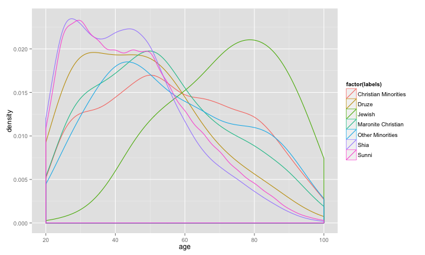

## Background

There are diverse voter groups in Lebanon that can affect the age distribution of voters. This is due to the dynamics of the 1975 Lebanese Civil War. We propose to create a Shiny App to show a comparison of these groups.

The app will contain:
- A checkbox selector to combine different groups 
- The density of the age distribution of each group
- The mean and median of the total selected population

--- 

## Sample plot


```r
require(ggplot2)
bey <- read.csv("bey.csv")
qplot(age, color=factor(labels), data=bey, geom="density", adjust=2)
```



--- 

## Analysis

We can see that each voter groups has different population density plots. Thus it would be interesting to see the effect of each group on the total electors by either including them or excluding them from the total.

The Shiny App is found [here](http://kamicut.shinyapps.io/project)

--- 

## References

The data is parsed and translated from [Lebanon Election Data Analysis](http://lebanonelectiondata.org), a project by the Lebanese Association for Democratic Elections.


